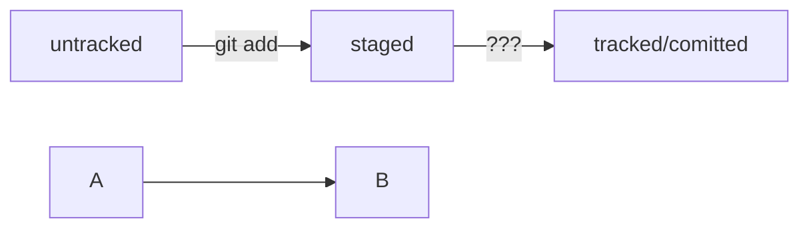

# Это проект GitHelper

---

Чтобы добавить проект в Github и далее редактировать нужно научиться гиту <br>
для начала создаем папку под проект и инициализируем его в гит командой `git init` <br>

HEAD -- это голова.<br>
Коммит -- это всему голова.<br>
Статусы файлов:

```mermaid
%% описание схемы
```


